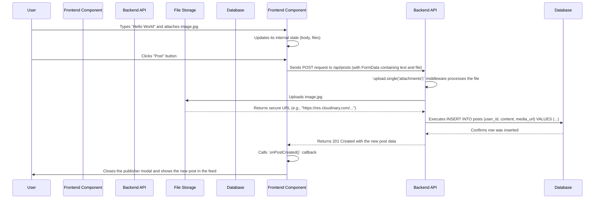
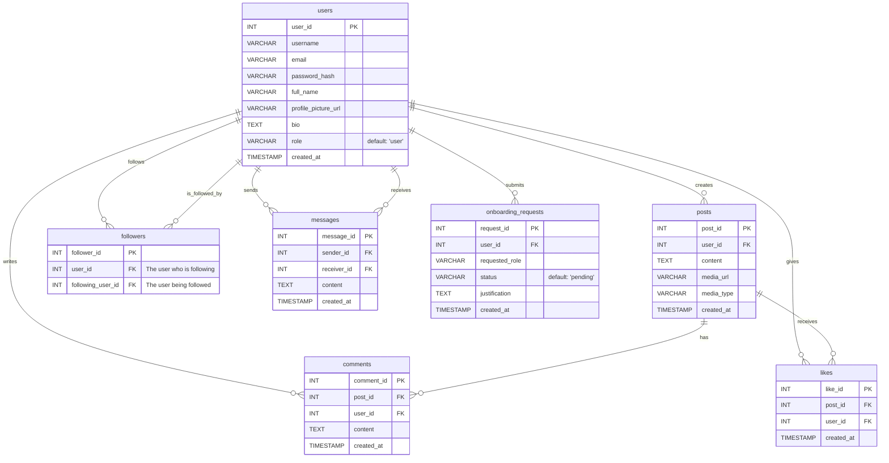

# CareerNest: Deep Dive Project Documentation

This document provides a developer-centric, in-depth analysis of the CareerNest platform. It is designed to onboard a new developer by explaining the "why" behind the architecture and the "how" of its implementation, from the frontend components to the backend services.

## 1. Project Vision & Introduction

### 1.1. The Problem
In today's competitive landscape, students, recent graduates, and academic professionals lack a unified platform that seamlessly integrates career development, professional networking, and institutional collaboration. Students struggle to find relevant job opportunities and connect with mentors. Professionals find it difficult to share their expertise and discover talent. Educational institutions (colleges, departments) need better tools to track student progress, engage with alumni, and connect with the industry.

### 1.2. Our Solution: CareerNest
**CareerNest** is a multi-faceted web platform designed to bridge this gap. It serves as a dynamic ecosystem where career-focused social networking meets a powerful job board and a sophisticated administrative tool for educational institutions.

Our vision is to create a thriving community that empowers users at every stage of their career journey. Whether it's a student looking for their first internship, a Head of Department (HOD) analyzing placement statistics, or a college administrator fostering industry partnerships, CareerNest provides the tools and connections they need to succeed.

The platform is built on a role-based access system, providing tailored experiences for:
- **Standard Users:** Students, alumni, and professionals.
- **HODs (Heads of Department):** Academic leaders managing departmental affairs.
- **College Admins:** Administrators with oversight of the entire institution.
- **System Admins:** Superusers with full control over the platform.

---

## 2. System Architecture & Core Concepts

The project follows a **monorepo** structure with a decoupled **client-server architecture**. This separation is key: the frontend (React) is responsible for the user experience, while the backend (Node.js) handles business logic, data, and security.

### 2.1. Frontend (Client) - The User Experience Engine
- **Framework:** **Next.js** with the **App Router**. This isn't just a choice for creating pages; it provides Server-Side Rendering (SSR), which means pages are delivered to the user faster and are SEO-friendly.
- **Structure (`client/`):**
    - **`app/`**: The heart of the Next.js application. Each folder inside corresponds to a URL route (e.g., `/app/home` is the user's feed). `layout.tsx` defines the global page structure.
    - **`components/`**: Contains all the reusable building blocks of our UI. Components like `PostCard.tsx` and `Navbar.tsx` are designed to be modular and independent.
    - **`context/UserContext.tsx`**: This is our global state manager for authentication. It holds the logged-in user's data and makes it available to all other components, preventing the need to pass user data down through many layers of components (a problem known as "prop drilling").

### 2.2. Backend (Server) - The Brains of the Operation
- **Framework:** **Node.js** with **Express.js**. This provides a fast, efficient, and highly customizable foundation for our REST API.
- **Structure (`server/`):**
    - **`index.js`**: The main entry point. It initializes the Express server, sets up middleware (like `cors` and `express.json`), and defines every single API endpoint the frontend can call.
    - **`authMiddleware.js`**: Our security guard. This middleware intercepts every protected API request to check for a valid JSON Web Token (JWT). It also contains role-specific guards (`isCollegeAdmin`, `isHODorAdmin`) to ensure, for example, that only an HOD can access HOD-specific data.
    - **`database.js`**: A centralized module that manages the connection pool to our PostgreSQL database. This is more efficient than creating a new database connection for every single query.
    - **Service Modules (`cloudinaryService.js`, `s3Service.js`, `emailService.js`)**: These files abstract away the complexity of interacting with third-party APIs. For example, when a user uploads a profile picture, the API route calls a function from `cloudinaryService.js` instead of having the Cloudinary logic cluttered inside the route handler itself.

---

## 3. Deep Dive: The Authentication Flow

Understanding how a user logs in and stays logged in is critical. We use a standard, secure, and stateless JWT-based approach.

**Step-by-Step Login Process:**

1.  **User Enters Credentials (Frontend):** The user fills out the form on the `/login` page. The state of the form is managed by the `Login` page component.
2.  **API Call to Backend:** On submission, the frontend makes a `POST` request to the `/api/auth/login` endpoint, sending the user's email and password in the request body.
3.  **Backend Validation:**
    a. The `/api/auth/login` handler in `server/index.js` receives the request.
    b. It queries the database to find a user with the matching email.
    c. If a user is found, it uses `bcrypt.compare()` to check if the provided password, when hashed, matches the stored `password_hash` in the `users` table. This is a critical security step; we never store plain-text passwords.
4.  **JWT Generation:**
    a. If the password is correct, the backend generates a **JSON Web Token (JWT)** using `jsonwebtoken.sign()`.
    b. This token is a signed, encoded string containing a "payload" of non-sensitive user data (e.g., `user_id`, `role`, `college_id`). The signature ensures the token cannot be tampered with.
5.  **Token Sent to Frontend:** The backend sends a `200 OK` response containing the JWT and the user's profile data.
6.  **Frontend Stores Session:**
    a. The frontend receives the token and user data.
    b. It stores the token and user object in the browser's `localStorage`. This makes the session persistent across page reloads.
    c. It updates the `UserContext` with the user's data, which triggers a re-render. The `AppLayout` component now shows the main application UI (like the `Sidebar`) instead of the login page.

**How the User Stays Logged In (Authenticated Requests):**

1.  **Frontend Makes a Request:** When the user performs an action (e.g., fetching posts), the frontend API utility attaches the JWT from `localStorage` to the request in the `Authorization` header (e.g., `Authorization: Bearer <token>`).
2.  **Backend Middleware Intercepts:** The request first hits the `authMiddleware` in `server/authMiddleware.js`.
3.  **Token Verification:** The middleware inspects the header, extracts the token, and uses `jsonwebtoken.verify()` with the `JWT_SECRET` to check its validity and signature.
4.  **User Context Injection:** If the token is valid, the middleware decodes its payload and attaches it to the request object as `req.user`.
5.  **Access Granted:** The request is now "authenticated" and is passed to the actual API route handler (e.g., the `/api/posts` handler), which can now trust `req.user` to know who is making the request. If the token is invalid, the middleware immediately sends a `401 Unauthorized` error.

---

## 4. User Roles & Functionality Deep Dive

CareerNest's functionality is dictated by a robust Role-Based Access Control (RBAC) system. A user's role determines what they can see and do. The role is assigned upon registration and stored in the `users` table. It is then encoded into the JWT upon login and checked by middleware on the backend for every protected API call.

Here is a detailed breakdown of each role:

### 4.1. Super Admin
The Super Admin is the highest-level authority on the platform, responsible for the overall ecosystem and onboarding of new institutions.

**Key Functionalities:**
-   **College Onboarding Management:**
    -   Views all pending college onboarding requests via the `/admin` dashboard.
    -   **Approves Requests:** Approving a request triggers a backend transaction that:
        1.  Creates a new entry in the `universities` table.
        2.  Creates a new user account with the `College Admin` role for the person who made the request.
        3.  Sends a "set password" email to the new College Admin.
    -   **Rejects Requests:** Rejects applications that are duplicates, incomplete, or don't meet criteria, sending a notification email to the applicant.
-   **Platform Oversight:** Has access to system-wide analytics and can manage all user accounts across all colleges (functionality to be extended).

### 4.2. College Admin
The College Admin is the primary manager of a single institution (university or college) on CareerNest. They are created by the Super Admin.

**Dashboard:** `/college-admin`

**Key Functionalities:**
-   **Department Management:**
    -   Creates, edits, and deletes academic departments within their college.
    -   A department cannot be deleted if it contains active users, preventing data orphans.
-   **HOD (Head of Department) Management:**
    -   Assigns a new HOD to a department. This action creates a new user account for the HOD with the `HOD` role and `pending_invite` status.
    -   Sends an automated "set password" email invite to the newly assigned HOD.
    -   Can change the HOD for a department, which deactivates the old HOD's invite (if pending) and sends a new one.
-   **Email Domain Management:**
    -   Manages the list of official email domains for their college (e.g., `@mit.edu`, `@student.mit.edu`).
    -   This list is critical for automatically verifying the identity of new Students and Faculty during sign-up.
-   **Reporting and Analytics:**
    -   Views a high-level dashboard with statistics for their college, including total numbers of Students, Faculty, and Alumni.
    -   Can generate and view detailed reports of all users within their college, filterable by department, role, and status.

### 4.3. HOD (Head of Department)
An HOD is a specialized role responsible for managing a specific department within a college. They are assigned by a College Admin.

**Dashboard:** `/hod-admin`

**Key Functionalities:**
-   **Alumni Verification:** This is their primary administrative duty.
    -   Views a queue of pending alumni from their department who have signed up and are awaiting verification.
    -   Can view the verification documents (e.g., degree certificate) submitted by the alumni.
    -   **Approves:** Activates the alumnus's account.
    -   **Rejects:** Suspends the alumnus's account and sends a rejection notice.
    -   **Transfers:** If an alumnus signed up for the wrong department, the HOD can transfer the request to the correct department's queue.
-   **User Management (Department-Level):**
    -   Views a full roster of all users (Students, Faculty, Alumni) within their department.
    -   Can suspend the accounts of users within their department.
-   **Standard User Privileges:** Has all the same social networking capabilities as a Faculty member, including the ability to post jobs.

### 4.4. Student
The standard user role for currently enrolled students.

**Onboarding:**
-   Signs up using their official college email address.
-   The email's domain is automatically validated against the college's registered domains.
-   The account is activated immediately after verifying their email via a one-time password (OTP).

**Key Functionalities:**
-   **Social Networking:** Can create posts, comment, react, follow other users, and use the real-time chat.
-   **Job Board:** Can view and apply for job opportunities posted on the platform.
-   **Networking:** Can browse the `/people` directory to find and connect with other students, faculty, and alumni from their college.

### 4.5. Faculty
The standard user role for professors and other academic staff.

**Onboarding:**
-   Follows the same secure onboarding process as Students, requiring a verified official college email.

**Key Functionalities:**
-   **All Student Functionalities:** Possesses all the same social networking and networking capabilities as a Student.
-   **Job & Opportunity Posting:** Has the elevated privilege to post new job opportunities to the college's job board. This is a key feature for sharing industry connections and research positions with students and alumni.

### 4.6. Alumni
A verified former student of the institution. This role is crucial for mentorship and industry connections.

**Onboarding:**
-   Signs up using a personal email address (e.g., `@gmail.com`).
-   Because they don't have an official college email, they must upload a verification document (like a degree or transcript).
-   Their account enters a `pending_admin_approval` state and is placed in their selected department's verification queue.
-   Their account is only activated after being manually approved by their department's HOD.

**Key Functionalities:**
-   **All Faculty Functionalities:** Once approved, they have the same privileges as Faculty, including the ability to post jobs, create posts, and network with others. This empowers them to bring real-world opportunities back into the college ecosystem.

---

## 5. Deep Dive: The Authentication Flow

This flow illustrates how the frontend and backend work together.



---

## 6. Technology Stack (with "Why")

### 6.1. Frontend
- **Next.js 13+:** Chosen for its performance (SSR/SSG), file-based routing with the App Router, and overall developer productivity. The App Router allows for more granular control over layouts and loading states.
- **TypeScript:** Used to add static typing to the JavaScript codebase. In a project this size, it is not a "nice-to-have" but a necessity. It prevents entire classes of bugs, makes refactoring safer, and provides excellent editor autocompletion.
- **Tailwind CSS:** A utility-first CSS framework chosen for its ability to rapidly build custom designs directly in the markup. This avoids context-switching between TSX and CSS files and makes components more self-contained.
- **ESLint:** Enforces a consistent code style, preventing common errors and improving readability across the team.

### 6.2. Backend
- **Node.js:** A fast and scalable JavaScript runtime, allowing us to use a single language (JavaScript/TypeScript) across the entire stack, simplifying the development process.
- **Express.js:** A minimal and flexible Node.js web application framework. It doesn't impose a rigid structure, giving us the freedom to organize our backend logic as we see fit.
- **PostgreSQL:** A powerful, open-source object-relational database system known for its reliability, data integrity features (like transactions), and ability to handle complex queries efficiently.
- **JSON Web Tokens (JWT):** Used for stateless, secure authentication. "Stateless" is key—it means the server doesn't need to store session information, making the application easier to scale horizontally.

---

## 7. Local Development Setup

### 7.1. Prerequisites
- **Node.js:** Version 18.x or higher.
- **npm** or **yarn:** A modern version of either package manager.
- **PostgreSQL:** A running instance of a PostgreSQL server. You can install it locally or use a Docker container.

### 7.2. Backend Setup
1.  **Navigate to the server directory:** `cd server`
2.  **Install dependencies:** `npm install`
3.  **Set up the database:**
    - Make sure your PostgreSQL server is running.
    - Create a new database (e.g., `careernest_dev`).
    - Execute the `db.sql` script to create the necessary tables: `psql -U your_postgres_user -d careernest_dev -f db.sql`
4.  **Configure Environment Variables:**
    - Create a file named `.env` in the `server/` directory.
    - Copy the contents from the Environment Variables section below and fill in your actual credentials.
5.  **Start the server:** `npm run dev`. The backend API will now be running on `http://localhost:5000`.

### 7.3. Frontend Setup
1.  **Open a new terminal** and navigate to the client directory: `cd client`
2.  **Install dependencies:** `npm install`
3.  **Start the development server:** `npm run dev`. The frontend will be accessible at `http://localhost:3000`.

---

## 8. Environment Variables (`server/.env`)

**Never commit this file to version control.**

```env
# Server Configuration
PORT=5000

# Database Connection (PostgreSQL)
DB_USER=your_db_user
DB_HOST=localhost
DB_DATABASE=careernest_dev
DB_PASSWORD=your_db_password
DB_PORT=5432

# JWT Authentication - Use a long, random, and secret string
JWT_SECRET=your_super_secret_and_long_jwt_key

# Email Service (using Nodemailer with a service like Gmail or SendGrid)
EMAIL_HOST=smtp.gmail.com
EMAIL_PORT=587
EMAIL_USER=your_email@gmail.com
EMAIL_PASS=your_gmail_app_password

# Cloudinary Service (for image hosting)
CLOUDINARY_CLOUD_NAME=your_cloudinary_cloud_name
CLOUDINARY_API_KEY=your_cloudinary_api_key
CLOUDINARY_API_SECRET=your_cloudinary_api_secret

# AWS S3 Service (for file/video hosting)
AWS_ACCESS_KEY_ID=your_aws_access_key
AWS_SECRET_ACCESS_KEY=your_aws_secret_key
AWS_REGION=your_aws_region
S3_BUCKET_NAME=your_s3_bucket_name
```

---

## 9. Database Schema & ER Diagram

### 9.1. ER Diagram (Mermaid)


### 9.2. Table Breakdown
- **`users`**: The master table for all users. The `role` column is crucial for implementing RBAC. `password_hash` stores the securely hashed password.
- **`posts`**: Represents a single post made by a user. `media_url` and `media_type` handle associated images or videos.
- **`comments`**: Each row is a comment linked to a `post_id` and a `user_id`.
- **`likes`**: A simple join table to record which user liked which post. A unique constraint on (`post_id`, `user_id`) prevents duplicate likes.
- **`followers`**: A join table representing the social graph. If a row exists with `user_id`=A and `following_user_id`=B, it means "A follows B".
- **`messages`**: Stores individual chat messages between two users (`sender_id` and `receiver_id`).
- **`onboarding_requests`**: Logs all requests for role upgrades. The `status` column (`pending`, `approved`, `denied`) tracks the state of the request.

---

## 10. API Endpoint Documentation

All endpoints are prefixed with `/api`. Protected endpoints require a valid JWT in the `Authorization: Bearer <token>` header.

### Auth Endpoints
- `POST /auth/signup`: Registers a new user. Handles file upload for alumni verification.
- `POST /auth/login`: Authenticates a user and returns a JWT and user profile.
- `POST /auth/forgot-password`: Sends a password reset link to the user's email.
- `POST /auth/reset-password`: Sets a new password using a valid reset token.

### Post & Feed Endpoints
- `GET /posts`: (Protected) Gets the main feed of posts for the logged-in user.
- `POST /posts`: (Protected) Creates a new post. Expects `multipart/form-data` with `body` text and optional `attachments`.
- `PUT /posts/:postId`: (Protected) Updates an existing post.
- `DELETE /posts/:postId`: (Protected) Deletes a post owned by the user.
- `POST /posts/:postId/react`: (Protected) Adds or updates a reaction (like, celebrate, etc.) to a post.
- `DELETE /posts/:postId/react`: (Protected) Removes a reaction from a post.

### User & Profile Endpoints
- `GET /people`: (Protected) Gets a paginated list of other users in the same college for networking.
- `GET /users/search`: (Protected) Searches for users by name to enable the `@mention` feature.
- `GET /users/:userId`: (Protected) Gets public profile information for a specific user.
- `PUT /users/profile`: (Protected) Updates the logged-in user's own profile.

### HOD & Admin Endpoints
- `GET /hod-admin/alumni-queue`: (Protected, HOD/Admin only) Retrieves a list of alumni from the HOD's department who are pending verification.
- `POST /hod-admin/verify-alumnus`: (Protected, HOD/Admin only) Approves, rejects, or transfers an alumni verification request.
- `GET /college-admin/departments`: (Protected, College Admin only) Manages the departments within the college.

---

## 11. Deployment Guide

### 11.1. Backend Deployment (e.g., on Heroku, Render, or AWS)
1.  **Prepare your app:** Ensure your `server/package.json` has a `start` script: `"start": "node index.js"`. The server must read the port from `process.env.PORT`.
2.  **Platform Setup:** Create a new application on your chosen hosting platform.
3.  **Provision a Database:** Use a managed PostgreSQL service (like Heroku Postgres or AWS RDS). This is more reliable than running a database on the same server as your app. The service will provide a `DATABASE_URL`.
4.  **Set Environment Variables:** In your hosting platform's dashboard, add all the variables from your `.env` file (`JWT_SECRET`, `CLOUDINARY_...`, etc.).
5.  **Deploy:** Connect your GitHub repository for automatic deployments or push the code using the platform's CLI.

### 11.2. Frontend Deployment (on Vercel)
1.  **Sign up for Vercel:** Use your GitHub account.
2.  **Import Project:** Import your `CareerNest` repository.
3.  **Configure Project:**
    - Vercel will automatically detect it's a Next.js project.
    - Set the "Root Directory" to `client` in the project settings.
    - **Crucially, add an environment variable:**
      - `NEXT_PUBLIC_API_URL`: Set this to the URL of your deployed backend (e.g., `https://your-careernest-api.herokuapp.com`).
4.  **Deploy:** Click "Deploy". Vercel will build and deploy your frontend. Subsequent pushes to the `main` branch will trigger automatic redeployments.
