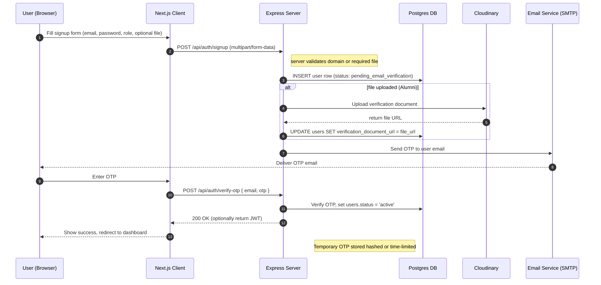
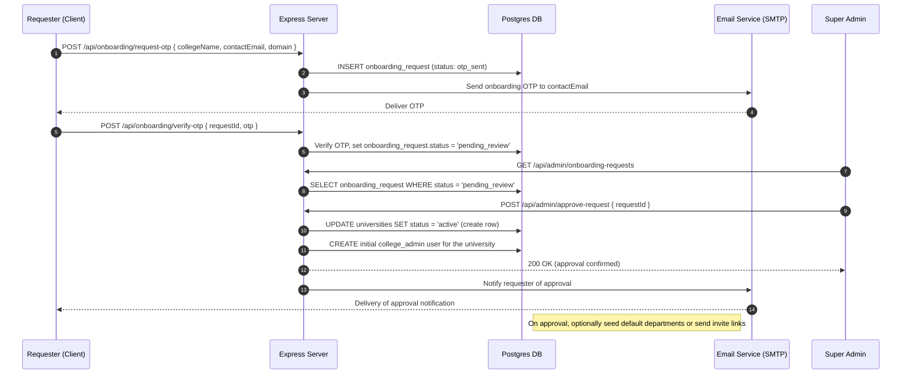
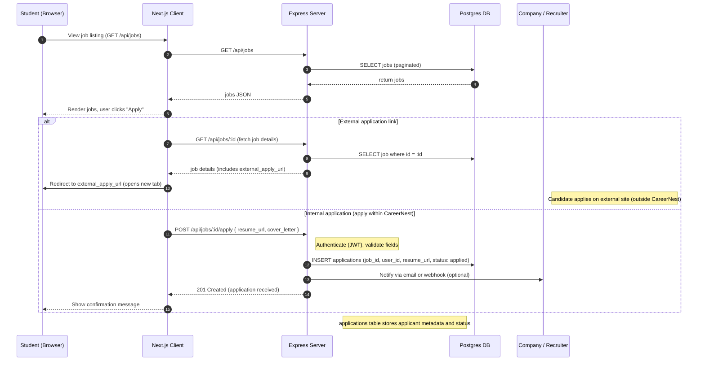

# Mermaid Sequence Diagrams — Signup & Onboarding

This file contains ready-to-render Mermaid code for the two main sequence diagrams used in the report: the user signup flow and the college onboarding flow. You can paste the Mermaid sections directly into Mermaid AI, the Mermaid Live Editor (https://mermaid.live), or any Markdown renderer that supports Mermaid blocks.

Instructions:
- If using Mermaid AI: paste the Mermaid code only (including the first line `sequenceDiagram`) into the prompt or editor. Request export as PNG or SVG at high resolution.
- If using mermaid.live: open the editor, delete sample code, paste the Mermaid code (including the `%%{init:...}%%` block if present) and click "Download" -> choose SVG/PNG.
- If your renderer supports fenced code blocks, paste the code inside a fenced block marked with `mermaid`.

Rendering tips:
- For publication quality, export as SVG. If you need PNG, export at a high DPI (or use SVG -> PNG conversion to control resolution).
- If lines overlap, try switching the flow direction or adding spacing comments (`Note over ...`) to separate elements.
- You can edit participant labels to match any local wording (e.g., change "Server" to "API Server (Express)").

---

## 1) Signup sequence diagram (Mermaid source)

Paste this block into Mermaid Live Editor or Mermaid AI to render the user signup flow.



Notes for the diagram:
- The `alt` block highlights the conditional path for alumni who upload a verification document. If not an alumnus, the upload + Cloudinary steps are skipped.
- The `autonumber` line adds step numbers; remove it if you prefer no numbers.

---

## 2) College Onboarding sequence diagram (Mermaid source)

Use this block to render the onboarding request and approval flow (requester -> email OTP -> super admin approval).



Notes for the diagram:
- If your implementation differs (e.g., additional HOD invitation step), you can insert extra participants and arrows.
---

## 3) Job-apply sequence diagram (Mermaid source)

Use this block to render the typical job-application flow. It covers both internal application storage and external-redirect scenarios.



Notes for the diagram:
- The diagram shows two common flows: redirecting the user to an external application URL (company careers page) or accepting an application internally and storing it in the `applications` table. Adapt field names to your actual DB schema (e.g., `applications`, `applicants`).
- For internal applications consider adding an application status workflow (received -> reviewed -> shortlisted -> rejected/accepted) and notify applicants via email updates.

---

---

## 3) How to export and include in the report

- Render and export the diagrams as SVG (preferred) or PNG (high DPI). Name files exactly as below and place them under `docs/images/`:
  - `docs/images/sequence-signup.png` (or `.svg`)
  - `docs/images/sequence-onboarding.png` (or `.svg`)

- Insert in your Markdown where noted (Section 4.3 in the report). Example markdown embed:

```markdown

Caption: Sequence diagram showing the signup flow including OTP verification and optional alumni document upload.
```

## 4) Optional: Mermaid variants and troubleshooting

- If you prefer a more compact layout, replace `autonumber` with `%%{init: { 'sequence': { 'mirrorActors': false } } }%%` (control visual options) before `sequenceDiagram`.
- For long labels, use short participant aliases and add a longer explanatory caption below the figure in the report.
- If your renderer strips fenced `mermaid` blocks, paste only the inner code (without triple backticks) into mermaid.live or Mermaid AI.

---

If you'd like, I can also:
- Produce the Mermaid ER diagram source generated from `server/db.sql` so you can render the ER directly in mermaid.live.
- Add a third sequence diagram for the job-apply flow.

Which additional diagram should I generate next? (ER from SQL, job-apply sequence, or both?)
